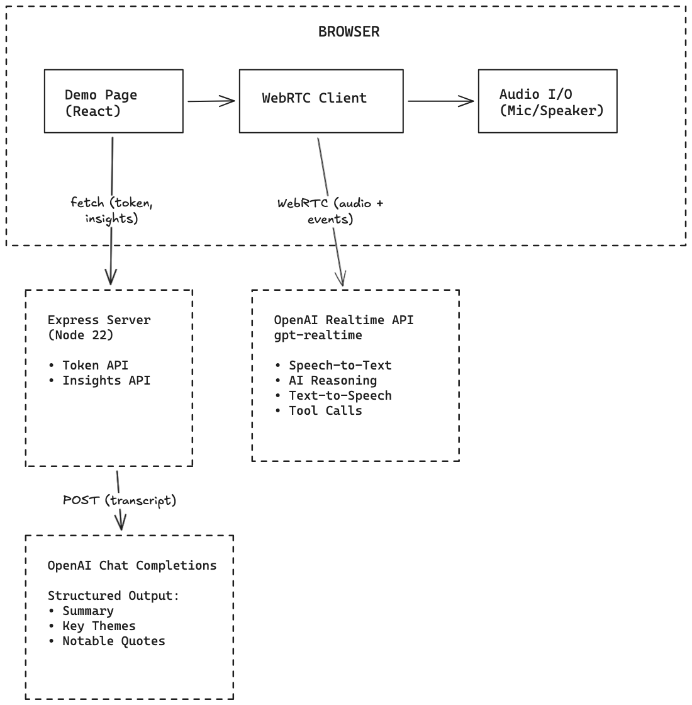
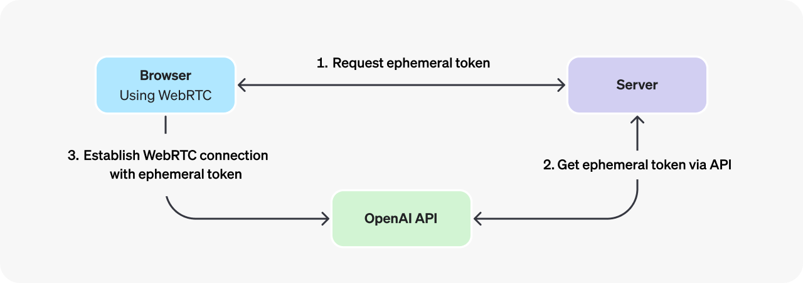
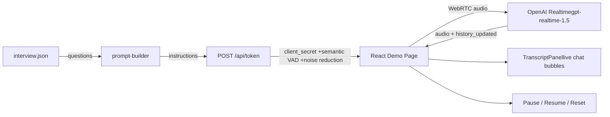
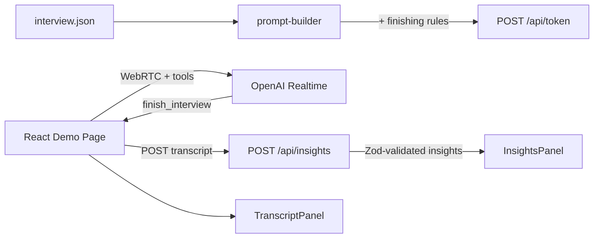

# Oxagile Voice Agent Workshop

 × 

Public starter repo for a 60-minute live workshop that builds a voice-powered interview app with OpenAI Realtime, React Router v7, and Express.

**Architecture:**


## What This Repo Is

- The workshop is taught branch-by-branch. Each named branch is a checkpoint attendees can jump to if they fall behind.
- The final app is a single-page voice interviewer: talk to an AI voice, answer the survey questions from `interview.json`, then view structured insights after the model ends the session.

## Branch Guide

- `01-scaffold`: base app scaffold and workshop setup
- `02-voice`: ephemeral token endpoint and browser voice connection
- `03-interview`: prompt-driven interview flow and live transcript
- `04-insights`: interview completion detection and structured insights
- `05-complete`: full working demo and workshop fallback branch

### `01-scaffold` branch about

This branch is to establish base app scaffold and demo setup.

### `02-voice` branch about

This branch is to establish scaffolder openai Realtime connection via the agent SDK using webRTC and the token endpoint.

Architecture:


### `03-interview` branch

This branch adds the prompt-driven interview flow and a live transcript panel. The server now builds a structured interviewer prompt from `interview.json` and sends it with the ephemeral token config (including semantic VAD and noise reduction).

On connect the browser fires `response.create` so the AI speaks the first question immediately.



### `04-insights` branch

This branch adds explicit interview completion via a Realtime tool (`finish_interview`), a server route that turns the transcript into structured insights, and an insights panel on the demo page.

The interviewer instructions tell the model to thank the participant in speech, then call `finish_interview` once. The tool handler POSTs the current transcript to `POST /api/insights`, which runs a Chat Completions call with Zod-validated JSON output, updates the UI, and closes the voice session.



### `05-complete` branch about

This branch is the full working demo and workshop fallback: all features from prior branches with stable defaults.

## Local Setup

Requirements:

- Node.js 22+
- `pnpm`
- `OPENAI_API_KEY` with Realtime API access for the voice branches

optional:

- [OpenAI developer documentation MCP server](https://developers.openai.com/learn/docs-mcp)

```json
{
  "mcpServers": {
    "openai-mcp": {
      "url": "https://developers.openai.com/mcp"
    }
  }
}
```

Install and run:

```bash
pnpm install
cp .env.example .env
pnpm dev
```

Open: [http://localhost:5173/](http://localhost:5173/)

## Deployment

### Docker

Build and run locally:

```bash
docker build -t oxagile-voice-agent-workshop .
docker run -p 3000:3000 oxagile-voice-agent-workshop
```

### Fly.io

Install the Fly.io CLI (`flyctl`): <https://fly.io/docs/flyctl/install/>

This repo includes a starter `fly.toml`. Update the Fly app name before the first deploy if needed.

```bash
fly launch --copy-config --no-deploy
fly secrets set OPENAI_API_KEY=...
fly deploy
```
